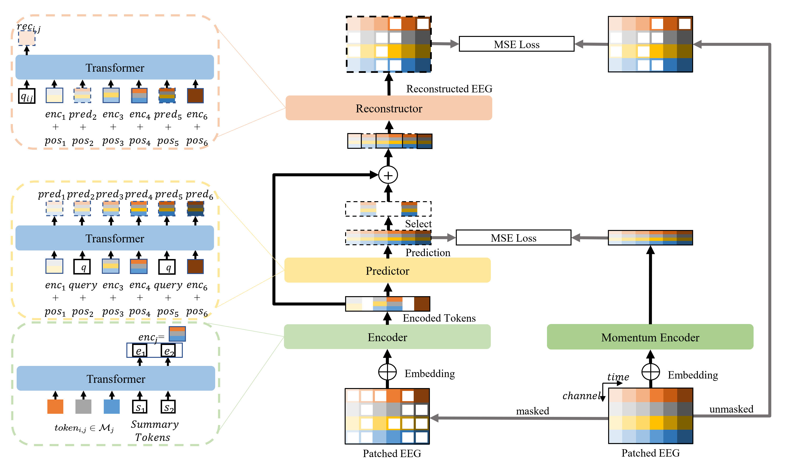

# EEGPT: Pretrained Transformer for Universal and Reliable Representation of EEG Signals

This repository is the official implementation of EEGPT: Pretrained Transformer for Universal and Reliable Representation of EEG Signals. 


EEGPT, a novel 10-million-parameter pretrained transformer model designed for universal EEG feature extraction. In EEGPT, a mask-based dual self-supervised learning method for efficient feature extraction is designed. Compared to other mask-based self-supervised learning methods, it adds spatio-temporal representation alignment, constructing a self-supervised task on EEG representations with high SNR and rich semantic information instead of raw signals, thus avoiding poor feature quality extracted from low SNR signals.

## Requirements

To install requirements:

```bash
pip install -r requirements.txt
```


## Datasets

Follow the instructions in the [datasets/pretrain/readme.md](datasets/pretrain/readme.md) to download the pre-training EEG dataset.
Then run the following command to preprocess the data:

```bash
cd datasets/pretrain
python prepare_pretrain_dataset.py
```
Note: If the script encounters an error when running, you can try running it again.

For downstream tasks, follow the instructions in the [datasets/downstream/readme.md](datasets/downstream/readme.md) to download and preprocess the downstream EEG datasets.

## Pretrained Models

You can download pretrained models here:

- [EEG_large](https://figshare.com/s/e37df4f8a907a866df4b) (in the 'Files/EEGPT/checkpoint/eegpt_mcae_58chs_4s_large4E.ckpt') trained on mixed dataset (58-channels, 256Hz, 4s time length EEG) using patch size 64. 

For downstream tasks, you should place it into `checkpoint` folder as file name "checkpoint/eegpt_mcae_58chs_4s_large4E.ckpt". To use the model, simply load the checkpoint and pass it to the `EEGPTClassifier` class in "downstream/Modules/models/EEGPT_mcae_finetune.py".

Other pretrained models:

- [BENDR](https://github.com/SPOClab-ca/BENDR) should be placed into `downstream/Modules/models/encoder.pt`.
- [BIOT](https://github.com/ycq091044/BIOT/tree/main/pretrained-models) should be placed into `downstream/Modules/BIOT/EEG-PREST-16-channels.ckpt`,`downstream/Modules/BIOT/EEG-SHHS+PREST-18-channels.ckpt`,`downstream/Modules/BIOT/EEG-six-datasets-18-channels.ckpt`.
- [LaBraM](https://github.com/935963004/LaBraM) should be placed into `downstream/Modules/LaBraM/labram-base.pth`.

## PRETRAINING TASK

To pretrain the model(s) in the paper, configure the `pretrain/configs.py` and run this command:

```bash
cd pretrain
python run_pretraining.py
```

## DOWNSTREAM TASK : TUAB and TUEV

To train the downstream task on TUAB and TUEV,
configure the `finetune_TUAB_EEGPT.sh` `finetune_TUEV_EEGPT.sh` and run this command:

```bash
cd downstream_tueg
pip install -r requirements.txt
./finetune_TUAB_EEGPT.sh
./finetune_TUEV_EEGPT.sh
```

## OTHER DOWNSTREAM TASKS

To train other downstream tasks,
configure the python scripts in the `downstream` folder and run this command:

```bash
cd downstream
python linear_probe_{model}_{dataset}.py
python finetune_{model}_{dataset}.py
```
